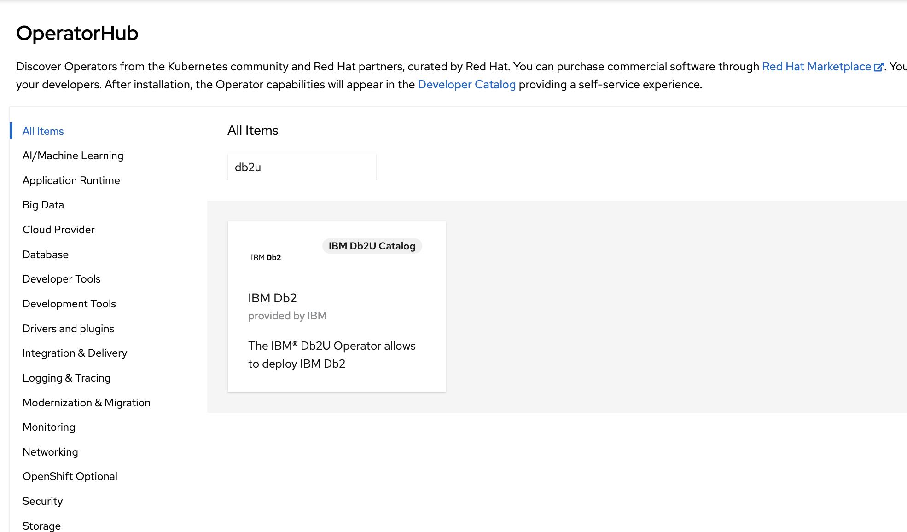
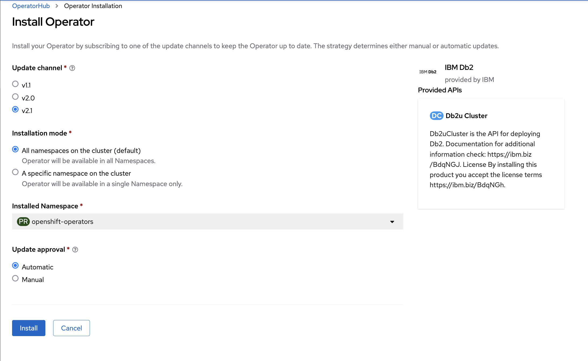
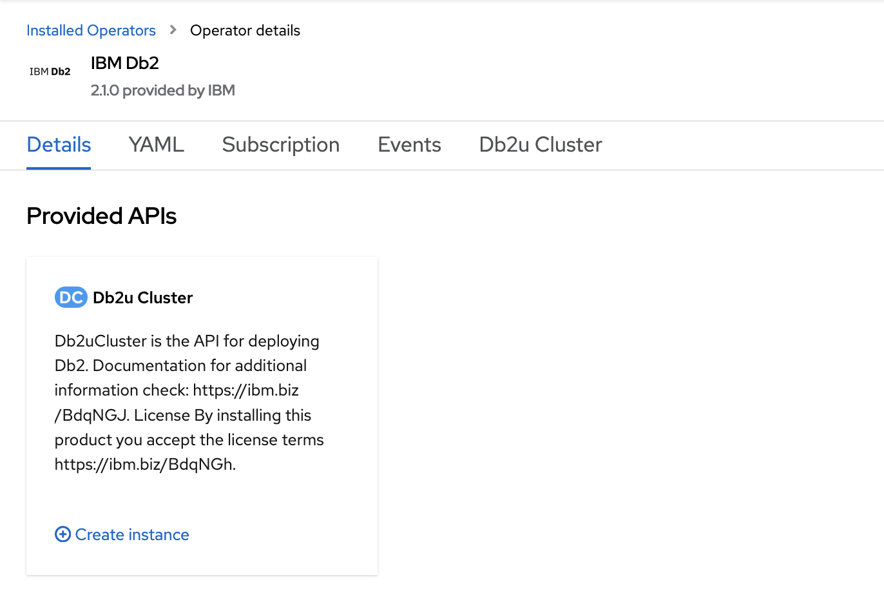
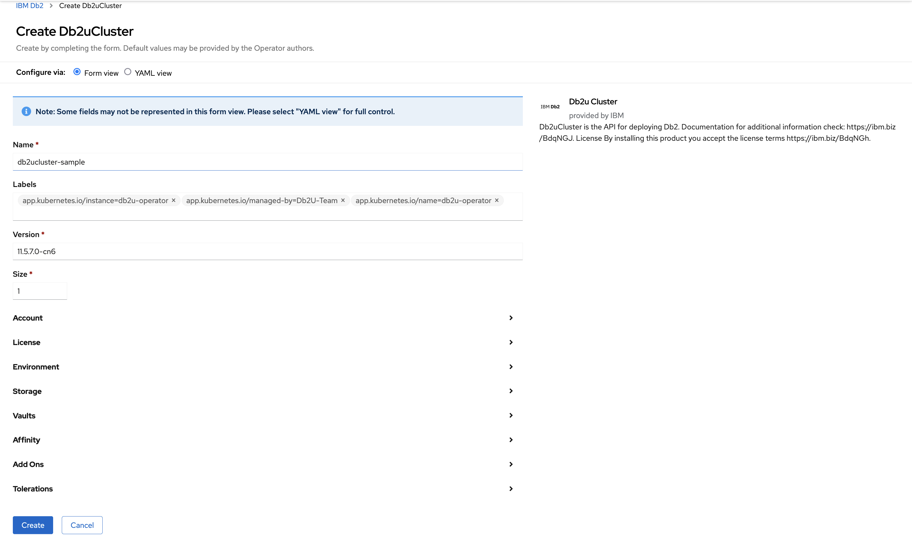
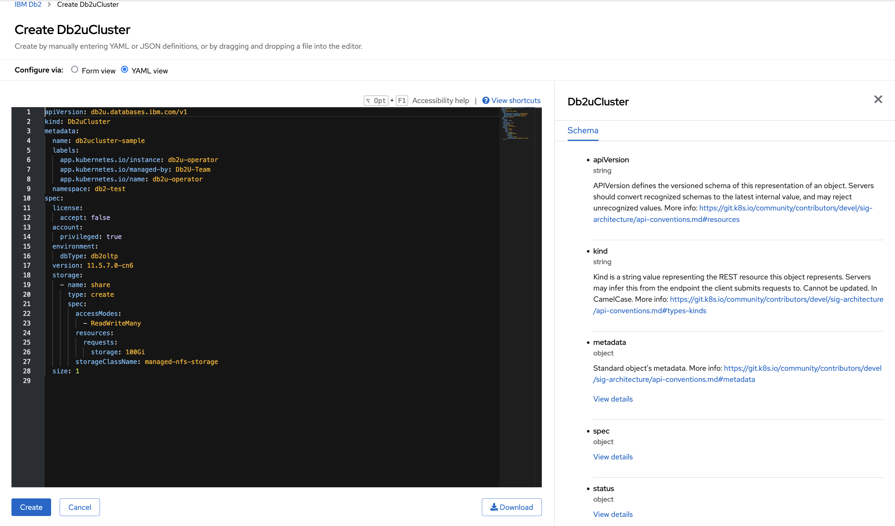

# Setting up IBM DB2u on Red Hat OpenShift

## 1. Installing the Db2 Operator from the IBM Operator Catalog

 [Official install docs](https://www.ibm.com/docs/en/db2/11.5?topic=db2-installing-operator)
 
 To view IBM offerings in the OpenShift Operator catalog, the catalog index image needs to be enabled. You enable the image on a Red Hat OpenShift V4.4 to V4.6 cluster through a CatalogSource resource.

### Procedure
To enable the IBM Operator Catalog in your OpenShift cluster:

1. From your OpenShift UI console, roll over the + icon on the tool bar and select Import YAML.
2. Paste the following YAML content into the space provided:


    ```
    apiVersion: operators.coreos.com/v1alpha1
    kind: CatalogSource
    metadata:
    name: ibm-operator-catalog
    namespace: openshift-marketplace
    spec:
    displayName: "IBM Operator Catalog" 
    publisher: IBM
    sourceType: grpc
    image: icr.io/cpopen/ibm-operator-catalog
    updateStrategy:
        registryPoll:
        interval: 45m
    ```

3. Click Create. From the navigation panel, under Provider Type, you should see an option for IBM Operators, from which you can install the Db2 Operator.


4. You can verify the installation by running the following from the command line:
   
   ``` 
   oc get CatalogSources ibm-operator-catalog -n openshift-marketplace 
   ```
5. You should now be able to view and install the Db2u operator from the operator hub in RHO console.



6. Select the channel version, installation mode, and update approval and click install.




## 2. Deploying Db2 using the Db2uCluster custom resource

When you have installed the Db2u Operator to your RHO cluster, you use the db2uCluster API to deploy Db2. Before doing so, you also need to set up any dedicated nodes within your cluster and configure your database storage.

[Deployment docs](https://www.ibm.com/docs/en/db2/11.5?topic=db2-deploying)


### Perform these steps for each worker node that you plan to dedicate to the database deployment. The steps use Db2 on Red Hat OpenShift CLI commands. The node_name is the name of a worker node on which you plan to host Db2.


1. Retrieve the name of the worker node that you want to dedicate to Db2:
```
oc get nodes
```

1. Taint the node with the NoSchedule effect and safely evict all of the pods from that node:

```
oc adm taint node node_name icp4data=database-db2oltp:NoSchedule --overwrite
oc adm drain node_name
oc adm uncordon node_name
```

3. Label the node:
```
oc label node node_name icp4data=database-db2oltp --overwrite
```
4. Optional: Verify that the node is labeled:
```
oc get node --show-labels
```

### Deploying the Db2u custom resource

[Docs](https://www.ibm.com/docs/en/db2/11.5?topic=db2-deploying-using-db2ucluster-cr)

You deploy Db2® by running Db2uCluster CR commands through a YAML script. You can do this through the console or Red Hat OpenShift command-line tool. 

1. To use the Red Hat OpenShift console, go to Installed Operators > IBM Db2 and click Create instance in the Db2uCluster API.



2. Through this tab page you create your Db2 instance, either by following the on-screen instructions of the form view, or by entering/pasting and running the YAML script.




1. Examples of two complete Db2uCluster CR's are located in db2u-install. 


## 3. Starting and configuring Db2 high availability disaster recovery (HADR)

You can set up a Db2® high availability disaster recovery (HADR) configuration between databases that are on the same cluster and in the same Red Hat® OpenShift® project.
[Official setup docs](https://www.ibm.com/docs/en/db2/11.5?topic=db2-high-availability-disaster-recovery-hadr)

### Prerequisites for configuring HADR for Db2 on OpenShift

Before you set up a Db2 HADR configuration on Red Hat OpenShift, be sure that you do the following tasks:

1. Install and deploy two or more Db2 database deployments that are at the same release level. These deployments will operate as the primary and standby databases. Use the same database name for all of the deployed databases that you will use in the Db2 HADR configuration.
2. Ensure that the primary and the standby deployments have the same password. Docs for updating the Db2 password secrets: https://www.ibm.com/docs/en/db2/11.5?topic=db2-updating-password-secrets

### Setting up an etcd store for HADR 

There are three methods to deploy an etcd store detailed [here](https://www.ibm.com/docs/en/db2/11.5?topic=hadr-setting-up-etcd-store)


1. Deploy the etcd that is packaged with the Db2 installation
2. Deploy the etcd that is packaged by Bitnami
3. Use the built-in etcd store (non-production, single OpenShift cluster environments only)

Using the first method, the following yaml file creates a StatefulSet with three replicas for deploying the etcd store, a persistent volume using volumeClaimTemplates to store the etcd data, and a service endpoint: https://www.ibm.com/docs/en/db2/11.5?topic=hadr-setting-up-etcd-store#aese-hadr-etcdstore_11-5-8__pkgd-by-db2


### Configuring the Db2 HADR API

Before beginning, ensure you have a shared volume for backup storage between the the primary and standby databases. 

Steps for deploying a shared volume between two Db2 instances are detailed here: https://www.ibm.com/docs/en/db2/11.5?topic=api-using-shared-volume-backup-storage

[This](db2u-operator/HADR_Standby.yaml) CR is an example of a shared backup storage persistent volume claim (PVC) from the primary database

HADR Procedure
1. Create a YAML file for the HADR custom resource definition on one of the master nodes and save the file, for example as /tmp/db2u_hadr.yaml. An example HADR CRD is located [here](db2u-operator/hadr-operator-config.yaml).
> You can use the ```oc get Db2uCluster``` command to get the names for the db2uCluster keyword.

2. Run the following command to create the CRD.
```
oc create -f /tmp/db2u_hadr.yaml
```
3. List the CRD:
```
oc get Db2uHadr
```
4. Use the following command to monitor the status of the CRD:
```
oc get db2uhadr db2u-oltp-hadr -oyaml | awk '/^status:/,/hadrSettings:/'
```
Here is an example status
```
status:
  conditions:
  - lastTransitionTime: "2020-10-21T23:16:33Z"
    message: Creating Db2u HADR configuration file on Standby
    status: "False"
    type: Creating Db2u HADR configuration files
  - lastTransitionTime: "2020-10-21T23:17:37Z"
    message: Done
    status: "True"
    type: Setting up Primary database copy for HADR
```

When the CRD status phase shows as Completed, the HADR setup is complete, automatic client reroute is enabled, and HADR is started.
[Db2 HADR API Docs](https://www.ibm.com/docs/en/db2/11.5?topic=hadr-configuring-db2-api)